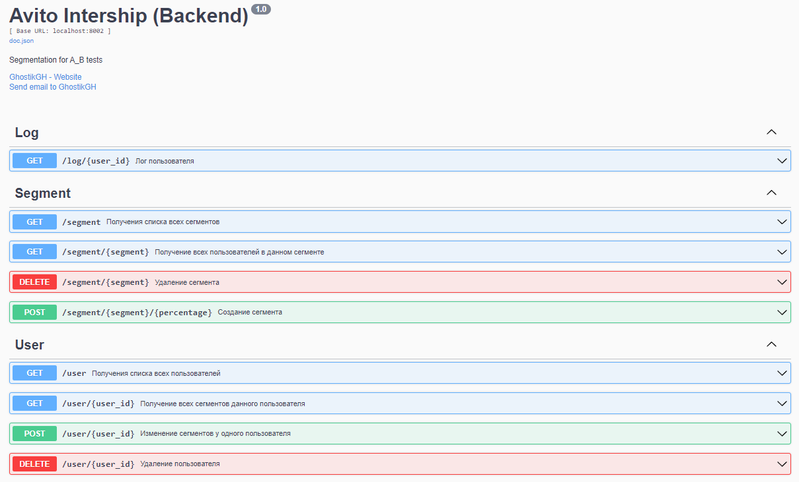

# [Техническое задание](TASK.md)

# Видеопрезентация функционала сервиса: coming soon!

<h4>

Платформа динамического сегментирования. Сервис позволяет создавать пользователей и присваивать им корректные (созданные раннее) сегменты.
Выполенены все минимальные и дополнительные требования к функционалу сервиса, а также минимальные запросы которые не указаны в задании, но по моему мнению могут быть полезны.

</h4>

# How to start

<h4>

Для работы сервиса необходим докер с поднятой базой, предлагаю воспользоваться самым простым способом:

```bash
docker run --name=segments -e POSTGRES_USER='admin' -e POSTGRES_PASSWORD='qweasd' -p 5432:5432 -d postgres
```

Для корректной работы переименуйте "example.env" в ".env", можете изменить секреты под себя, для изменения параметров сервера перейдите в config\local.yaml

Для начала работы запустите main.go

```bash
go run .\cmd\avito_back_intership\main.go
```

</h4>

<details>
<summary>Теперь вам доступа swagger документация по адрессу (если вы не меняли хост):</summary>



</details>

### http://localhost:8002/swagger/index.html

### Curl запросы для каждого метода, но более удобным будет выполнять эти же запросы через swagger

<h4>

Обязательные методы:

1. Метод создания сегмента. Принимает slug (название) сегмента и опционально количество процентов пользователей которые попадут в этот сегмент.

```
curl -X 'POST' \
  'http://localhost:8002/segment/AVITO_VOICE_MESSAGES' \
  -H 'accept: application/json' \
  -d ''
```

2. Метод удаления сегмента. Принимает slug (название) сегмента.

```
curl -X 'DELETE' \
  'http://localhost:8002/segment/AVITO_VOICE_MESSAGES' \
  -H 'accept: application/json'
```

Далее все запросы выполняются над юзером 1 (передается в параметрах пути)

3. Метод добавления пользователя в сегмент. Принимает список slug (названий) сегментов которые нужно добавить пользователю, список slug (названий) сегментов которые нужно удалить у пользователя, id пользователя.

```
curl -X 'POST' \
  'http://localhost:8002/user/1' \
  -H 'accept: application/json' \
  -H 'Content-Type: application/json' \
  -d '{
  "addedSeg": [
    {
       "segment": "AVITO_VOICE_MESSAGES"
    },
    {
       "segment": "A"
    }
  ],
  "removeSeg": ["A"]
}'
```

В данном примере сегмент A сначала добавится пользователю, но затем сразу же удалится, так как он указан в сегментах для удаления.

Обратите внимание что "addedSeg" принимает массив объектов, а "removeSeg" массив строк, это нужно для того чтобы реализовать удаление по времени пример такого запроса будет в Доп. Задании 2.

4. Метод получения активных сегментов пользователя. Принимает на вход id пользователя.

```
curl -X 'GET' \
  'http://localhost:8002/user/1' \
  -H 'accept: application/json'
```

---

_Доп. Задание 1. Создание CSV отчета_

```
curl -X 'GET' \
  'http://localhost:8002/log/1' \
  -H 'accept: application/octet-stream'
```

или просто http://localhost:8002/log/1

_Доп. Задание 2. Удаление по TTL_

```
curl -X 'POST' \
  'http://localhost:8002/user/1' \
  -H 'accept: application/json' \
  -H 'Content-Type: application/json' \
  -d '{
  "addedSeg": [
    {
      "segment": "AVITO_VOICE_MESSAGES",
      "time": "2023-08-28 07:36:00"
    },
    {
       "segment": "A"
    }
  ],
  "removeSeg": ["A"]
}'
```

Если вы хотите добавить автоматическое удаление в выбранное время, то его надо указывать в формате YYYY-MM-DD HH:MM:SS или YYYY-MM-DD.

_Доп. Задание 3. Автоматическое добавление пользователей_

```
curl -X 'POST' \
  'http://localhost:8002/segment/AVITO_VOICE_MESSAGES/50' \
  -H 'accept: application/json' \
  -d ''
```

В данном запросе после названия сегмемнта можно указать количество процентов (float от 0 до 100) от пользователей которые попадут в сегмент, в данном примере это 50.

Вспомогательные методы:

1. Если вы сомневаетесь создавали ли вы какой то сегмент или ваши коллеги, то вам обязательно пригодится метод, который возврщает список всех созданных сегментов

```
curl -X 'GET' \
  'http://localhost:8002/segment' \
  -H 'accept: application/json'
```

2. Аналогично предыдущему метод для пользователей, менее полезный и несет меньше смысла в продакшене, но удобный для проверки своей работы. Возвращает список всех пользователей.

```
curl -X 'GET' \
  'http://localhost:8002/user' \
  -H 'accept: application/json'
```

3. Метод удлаения пользователя. Как по мне очень важный метод, странно что его нет в минимальных требованиях.

```
curl -X 'DELETE' \
  'http://localhost:8002/user/1' \
  -H 'accept: application/json'
```

4. Метод для просмотра всех пользователей в данном сегменте. Кажется это то ради чего все создавалось, т. е. Регистрируешь всех пользователей -> Создаешь сегмент с случайным распределением -> Передаешь список добавленных пользователей дальше по сервисам -> Ждешь фидбек от аналитиков.

```
curl -X 'GET' \
  'http://localhost:8002/segment/AVITO_VOICE_MESSAGES' \
  -H 'accept: application/json'
```

</h4>

## Underway:

1. Mock testing
2. Видеопрезентации
